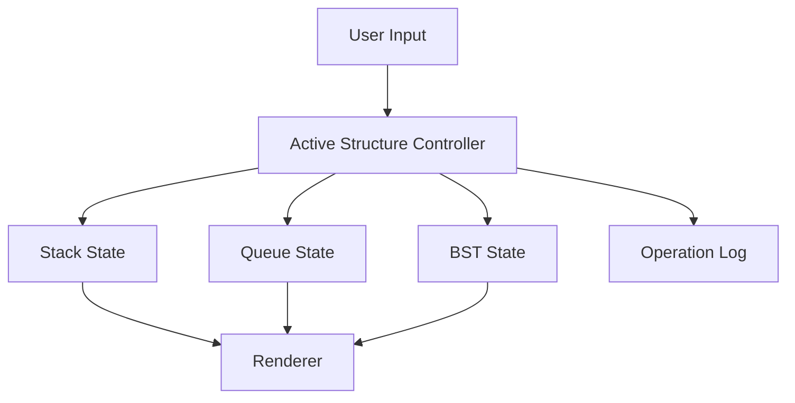

# Data Structures Browser Demo

Framework-free data structures visualizer for stack, queue, linked list, and binary search tree operations.

## Features

- **Stack**: push/pop with top indicator.
- **Queue**: enqueue/dequeue with front indicator.
- **Linked List**:
  - append
  - remove head
- **BST**:
  - insert
  - delete
  - path-animated search
- BST traversal now uses an explicit mode picker for in-order, pre-order, post-order, and level-order runs instead of cycling a hidden mode.
- Search Insight board now turns the last lookup into a concrete scan-depth or predecessor/successor read so search cost is visible, not implied.
- Stack, queue, and linked-list search now animate the scan path instead of jumping straight to the answer.
- Operation log with timestamped actions.
- Workspace import/export as JSON snapshots.
- Workspace import/export now preserves linked-list state alongside stack, queue, and BST data.
- Legacy share URLs now decode through UTF-8-safe logic without deprecated browser APIs.
- Copy Demo Brief converts the active structure snapshot, operator playbook, and share link into a clipboard-ready walkthrough note.
- Copy Migration Brief packages the current switchboard, lookup contrast, and transfer-cost posture into one handoff note.
- Responsive layout and keyboard-friendly controls.
- Shortcut-first walkthrough support:
  - `1-4` switch active structures
  - `Enter` adds from the value field
  - `Shift + Enter` loads the bulk sequence
  - `Z` / `Y` undo or redo
- Undo and redo history for structural edits.
- BST rebalance control rebuilds the current tree from its in-order values to show how shape affects lookup behavior.
- BST rebalance now emits a before/after height and average-depth report so the payoff is explicit instead of implied.
- Search now works across stack, queue, and linked-list modes in addition to BST path search.
- Active-structure complexity guide for add/remove/lookup operations.
- Active-structure metric cards now switch between linear snapshots (top/front/head, range, duplicates) and BST diagnostics.
- BST diagnostics now surface min/max values, leaf count, and balance shape.
- Linear structures now keep stable node objects across manual add, sample load, import, and search flows so highlights and metrics stay correct.
- Next move preview explains what the next add/remove/search action would do before you commit it.
- Challenge objective panel tells you when the current structure is actually rich enough for a portfolio-quality walkthrough and what setup move is still missing.
- Operator playbook converts the current structure state into a concrete demo script and a watch-out note for walkthroughs.
- Structure switchboard tells you when the current workload would actually teach better as a different data structure.
- Invariant check panel verifies the active structure's expected top/front/head/tree ordering behavior.
- Stress test panel suggests the next add/remove/rebalance move that best exposes the active structure's behavior.

## Demo Flow

1. Load a challenge scenario.
2. Switch structures to compare order behavior under the same data.
3. Choose a traversal mode, run it, then rebalance the BST once the lookup-path contrast is clear.

## Fast demo flow

1. Load or build a small workload.
2. Use the switchboard and complexity guide to explain why the active structure fits or fails.
3. Copy the demo brief or shareable URL when you want a reproducible walkthrough state.
- Study handoff panel turns the active state into a one-minute recap plus the next move worth showing in a walkthrough.
- Storage Lens explains how the current structure's visible shape maps to edge access, pointer traversal, or branch-path lookup cost.
- Behavior promise lens translates the current structure into the caller-facing guarantee it is preserving: recency, arrival order, traversal order, or ordered lookup.
- History pressure board reads the current undo/redo depth as a state-management story instead of only a structure snapshot.
- Branch rehearsal board detects when redo depth creates a meaningful alternate future worth calling out in the walkthrough.
- Share payload board explains when the URL snapshot is still a quick share link and when JSON export is the better handoff artifact.

## Technical Design

- `index.html`: semantic controls and visualization panel.
- `styles.css`: reusable design system and tree styling.
- `script.js`: pure JavaScript state machine and render functions.



## Local Run

```bash
python -m http.server 8000
```

Open `http://localhost:8000`.

## Portfolio Demo Path

1. Load a sample dataset.
2. Switch between stack, queue, linked list, and BST to show shared controls.
3. Run search or traversal on the active structure.
4. Read the Search Insight board so the lookup result includes path cost instead of only a hit/miss outcome.
5. Copy the demo brief so the walkthrough has a portable artifact.
5. Use the Stress Test panel to stage a more revealing follow-up move after the first walkthrough.

## Reproducibility Workflow

- `Copy Share Link` is the fastest path when the current structure state should reopen exactly in the browser.
- `Copy Snapshot Brief` is the better handoff when the state alone is not enough and you need the current invariant, payload, and lens summary preserved too.
- `Export State` is the safer path when the structure is dense enough that a URL should not be the only artifact.

## GitHub Pages Compatibility

- No build tooling required.
- Static HTML/CSS/JS only.
- Works directly from repository root.

## Portfolio Positioning

- Honest label: static browser data-structures demo.
- Best use: quick walkthroughs of stack, queue, linked-list, and BST behavior without framework overhead.
- Public quality rule: preserve the fast teaching loop before adding more explanatory surfaces.

## Relationship To The React Archive

- This repo is the primary public deployment because it is faster to load, easier to host on GitHub Pages, and better aligned with the current portfolio direction.
- The archived React repo is still useful for state-orchestration study, but public walkthroughs should usually start here and only point to React when implementation tradeoffs matter.

## Future Improvements

- Add heap and graph modules.
- Add side-by-side complexity hints per structure.
- Add queue/linked-list search variants beyond remove-head.

## Fast QA Loop

Use this quick QA loop before publishing:

1. Load each structure once via `Load Sample`.
2. Trigger one add/remove/search action per structure.
3. Verify undo/redo works after a bulk import.
4. Export state and import it back; confirm counters and operation log remain consistent.

## Quick Verification Command

Run this syntax check before sharing updates:
- node --check script.js

