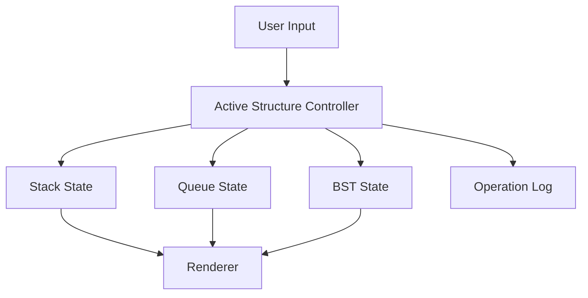

# Data Structures Playground (Vanilla)

Framework-free data structures visualizer for stack, queue, linked list, and binary search tree operations.

## Features

- **Stack**: push/pop with top indicator.
- **Queue**: enqueue/dequeue with front indicator.
- **Linked List**:
  - append
  - remove head
- **BST**:
  - insert
  - delete
  - path-animated search
- Operation log with timestamped actions.
- Workspace import/export as JSON snapshots.
- Workspace import/export now preserves linked-list state alongside stack, queue, and BST data.
- Copy Demo Brief converts the active structure snapshot, operator playbook, and share link into a clipboard-ready walkthrough note.
- Responsive layout and keyboard-friendly controls.
- Shortcut-first walkthrough support:
  - `1-4` switch active structures
  - `Enter` adds from the value field
  - `Shift + Enter` loads the bulk sequence
  - `Z` / `Y` undo or redo
- Undo and redo history for structural edits.
- BST rebalance control rebuilds the current tree from its in-order values to show how shape affects lookup behavior.
- Search now works across stack, queue, and linked-list modes in addition to BST path search.
- Active-structure complexity guide for add/remove/lookup operations.
- Active-structure metric cards now switch between linear snapshots (top/front/head, range, duplicates) and BST diagnostics.
- BST diagnostics now surface min/max values, leaf count, and balance shape.
- Linear structures now keep stable node objects across manual add, sample load, import, and search flows so highlights and metrics stay correct.
- Next move preview explains what the next add/remove/search action would do before you commit it.
- Challenge objective panel tells you when the current structure is actually rich enough for a portfolio-quality walkthrough and what setup move is still missing.
- Operator playbook converts the current structure state into a concrete demo script and a watch-out note for walkthroughs.
- Invariant check panel verifies the active structure's expected top/front/head/tree ordering behavior.
- Stress test panel suggests the next add/remove/rebalance move that best exposes the active structure's behavior.

## Technical Design

- `index.html`: semantic controls and visualization panel.
- `styles.css`: reusable design system and tree styling.
- `script.js`: pure JavaScript state machine and render functions.



## Local Run

```bash
python -m http.server 8000
```

Open `http://localhost:8000`.

## Portfolio Demo Path

1. Load a sample dataset.
2. Switch between stack, queue, linked list, and BST to show shared controls.
3. Run search or traversal on the active structure.
4. Copy the demo brief so the walkthrough has a portable artifact.
5. Use the Stress Test panel to stage a more revealing follow-up move after the first walkthrough.

## GitHub Pages Compatibility

- No build tooling required.
- Static HTML/CSS/JS only.
- Works directly from repository root.

## Future Improvements

- Add heap and graph modules.
- Add side-by-side complexity hints per structure.
- Add queue/linked-list search variants beyond remove-head.
