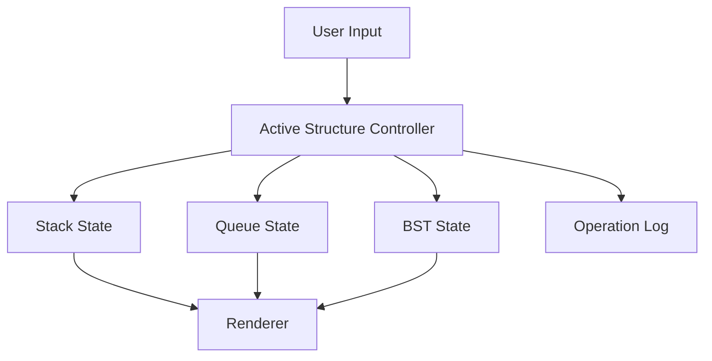

# Data Structures Playground (Vanilla)

Framework-free data structures visualizer for stack, queue, and binary search tree operations.

## Features

- **Stack**: push/pop with top indicator.
- **Queue**: enqueue/dequeue with front indicator.
- **BST**:
  - insert
  - delete
  - path-animated search
- Operation log with timestamped actions.
- Responsive layout and keyboard-friendly controls.

## Technical Design

- `index.html`: semantic controls and visualization panel.
- `styles.css`: reusable design system and tree styling.
- `script.js`: pure JavaScript state machine and render functions.



## Local Run

```bash
python -m http.server 8000
```

Open `http://localhost:8000`.

## GitHub Pages Compatibility

- No build tooling required.
- Static HTML/CSS/JS only.
- Works directly from repository root.

## Future Improvements

- Add linked list and heap modules.
- Add undo/redo operation history.
- Export and import structure states as JSON.