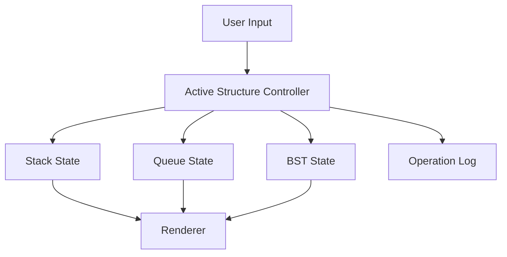

# Data Structures Playground (Vanilla)

Framework-free data structures visualizer for stack, queue, linked list, and binary search tree operations.

## Features

- **Stack**: push/pop with top indicator.
- **Queue**: enqueue/dequeue with front indicator.
- **Linked List**:
  - append
  - remove head
- **BST**:
  - insert
  - delete
  - path-animated search
- Operation log with timestamped actions.
- Workspace import/export as JSON snapshots.
- Workspace import/export now preserves linked-list state alongside stack, queue, and BST data.
- Responsive layout and keyboard-friendly controls.
- Undo and redo history for structural edits.
- Search now works across stack, queue, and linked-list modes in addition to BST path search.

## Technical Design

- `index.html`: semantic controls and visualization panel.
- `styles.css`: reusable design system and tree styling.
- `script.js`: pure JavaScript state machine and render functions.



## Local Run

```bash
python -m http.server 8000
```

Open `http://localhost:8000`.

## GitHub Pages Compatibility

- No build tooling required.
- Static HTML/CSS/JS only.
- Works directly from repository root.

## Future Improvements

- Add heap and graph modules.
- Add side-by-side complexity hints per structure.
- Add queue/linked-list search variants beyond remove-head.
